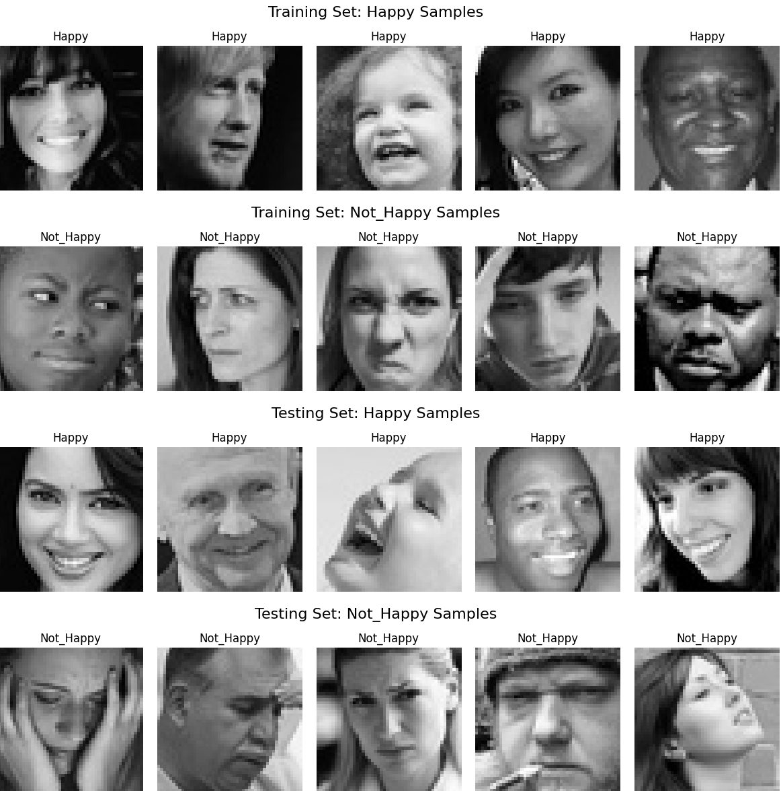
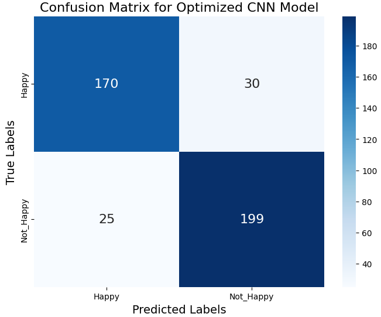
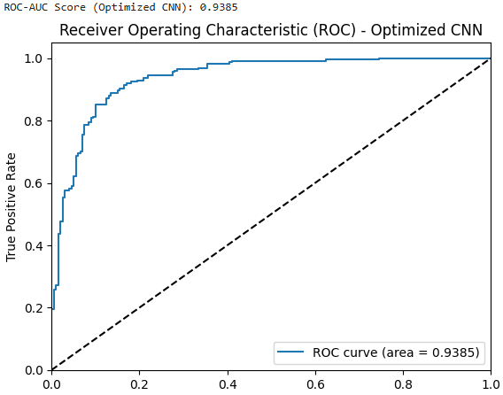
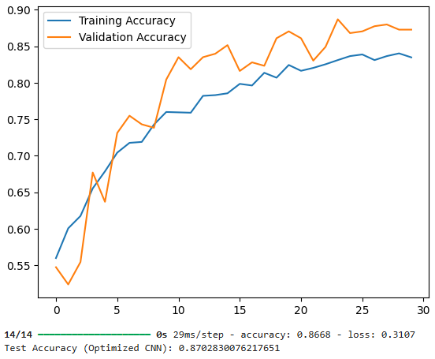

# Emotion_Detection_Project
Emotion detection using deep learning to classify facial expressions as Happy or Not Happy.

## Project Overview
This project focuses on emotion detection using deep learning to classify facial expressions as either *Happy* or *Not Happy*. It leverages a deep learning model trained on image data, applying convolutional neural networks (CNNs) and transfer learning techniques to achieve high accuracy in emotion classification.

## Data Source
The dataset used for this project contains 4,446 images, each 48x48 pixels in grayscale, labeled as *Happy* or *Not Happy*. You can access the dataset [here](https://drive.google.com/file/d/1xESsWYBfx3FzR7-n-QWd3Sqh4hd2GmgF/view?usp=drive_link).

## Methods and Techniques
- **Data Preprocessing**: Each image was resized, normalized, and converted to grayscale to standardize inputs for the model.
- **Models Used**:
  - **Artificial Neural Network (ANN)**: Used as a baseline to evaluate the data before applying more complex models.
  - **Convolutional Neural Network (CNN)**: A CNN model was developed to improve accuracy with image-specific features.
  - **Transfer Learning (VGG16)**: Transfer learning with VGG16 was utilized to further enhance performance, leveraging a pre-trained model on a large dataset.
- **Performance Metrics**: Test accuracy, ROC-AUC, and F1 score were used to evaluate and compare model performance.

## Key Results
- **Best Model**: The optimized CNN model achieved a test accuracy of 87% and an ROC-AUC of 0.94.
- **Model Comparison**: The CNN and VGG16 transfer learning models significantly outperformed the baseline ANN.

## Visualizations
The following visualizations provide insights into the model's performance and the dataset:

### Sample Images from Dataset
Below are example images from the dataset, showing both "Happy" and "Not Happy" expressions in the training and testing sets.



### Confusion Matrix - Optimized CNN
This confusion matrix shows the classification results of the optimized CNN model on the test set.



### ROC-AUC Curve - Optimized CNN
The ROC-AUC curve demonstrates the performance of the optimized CNN model, achieving a high area under the curve (AUC) of 0.9385.



### Training and Validation Accuracy - Optimized CNN
This plot shows the training and validation accuracy of the optimized CNN model over epochs, illustrating how the model's performance improved during training.



## Project Report
The final project report is available for download and includes detailed analysis, findings, and insights. Due to its size, it is not viewable directly on GitHub, but you can download it and view it locally.

- [Download Final Report](reports/Final_Report.pptx)

## Repository Structure
- `notebooks/`: Contains the Jupyter notebook(s) used for data preprocessing, model training, and evaluation.
- `reports/`: Project reports detailing exploratory data analysis, model building steps, and final insights.
- `images/`: Visualizations and example results, including ROC curves, accuracy plots, and sample images.
- `data/`: Placeholder for data or a link to the dataset source if it’s not stored in the repository.

## Future Improvements
- Further hyperparameter tuning to optimize model performance.
- Experimenting with additional deep learning architectures to potentially improve accuracy.
- Applying data augmentation techniques to enhance the robustness of the model with smaller datasets.

## Skills Demonstrated
- **Data Preprocessing**: Image resizing, normalization, and handling grayscale format.
- **Deep Learning**: Developed and optimized CNNs for image classification.
- **Transfer Learning**: Applied VGG16 pre-trained model to improve model accuracy.
- **Model Evaluation**: Utilized metrics such as accuracy, ROC-AUC, and F1 score for comprehensive model evaluation.

## Getting Started
1. **Clone the repository**:
   ```bash
   git clone https://github.com/ios79/Emotion_Detection_Project.git
   cd Emotion_Detection_Project
